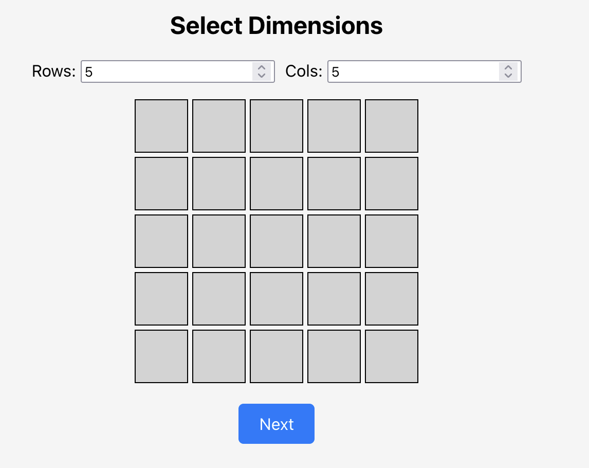
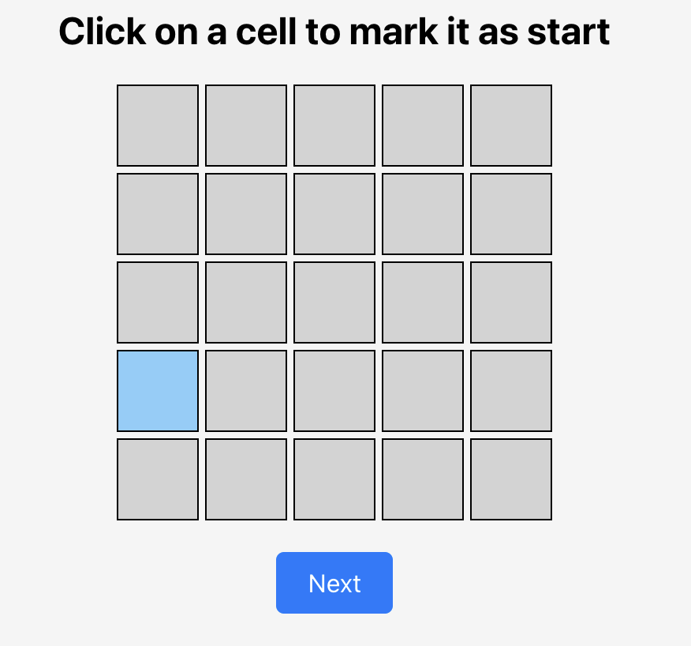
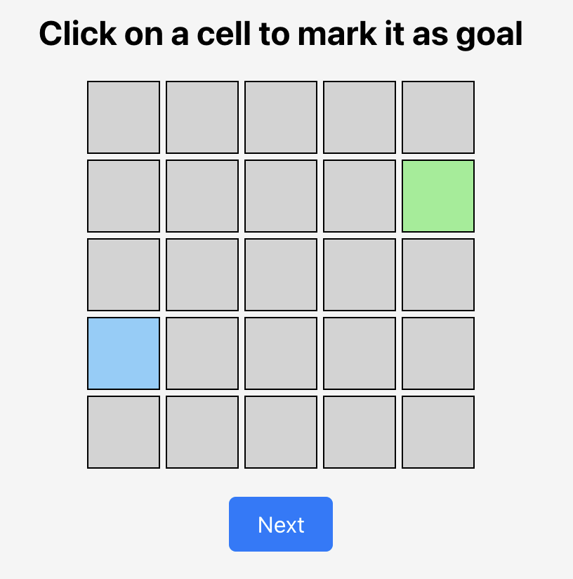
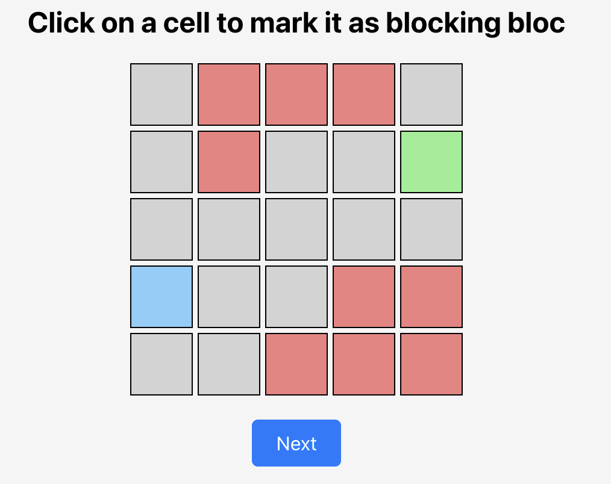

# Step 1: Select the dimensions

# Step 2: Select your starting point

# Step 3: Select your target

# Step 4: Add some boundries

# Step 5: Find Path

## Initial Generation

- all candidates starts from the starting point
- all candidates will take the same number of steps which is egal to 3 \* max(number of columns, number of rows)
- the initials steps are randomly generated

## Iterations

1. each candidate takes all the steps
2. if one candidate reach the goal we stop and print it's path otherwise we continue
3. candidates are sorted then based on their closeness to the goal, the top 50% will be kept while the rest are discarded
4. for each two consicitive pairs we generate two childs as follows:
   1. choose a random number n
   2. split the parents path into n non necessairy equal sub path is such a way that the length of i_th path of the first parent equals to the second parents
   3. the first child will get the first chunk from the first parent then the second chunk from the second parent and so on
   4. the second child will do the same, but it's start with the second parent
5. 10% of the child's steps get mutated (randomly changed)
